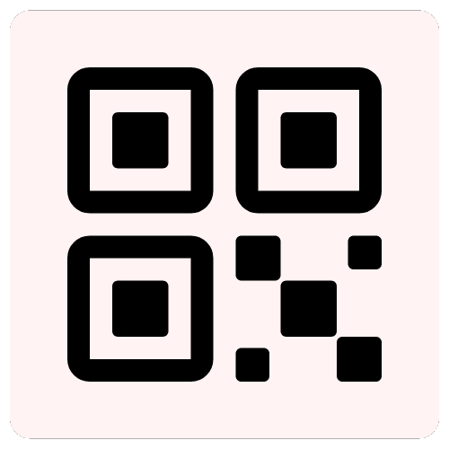
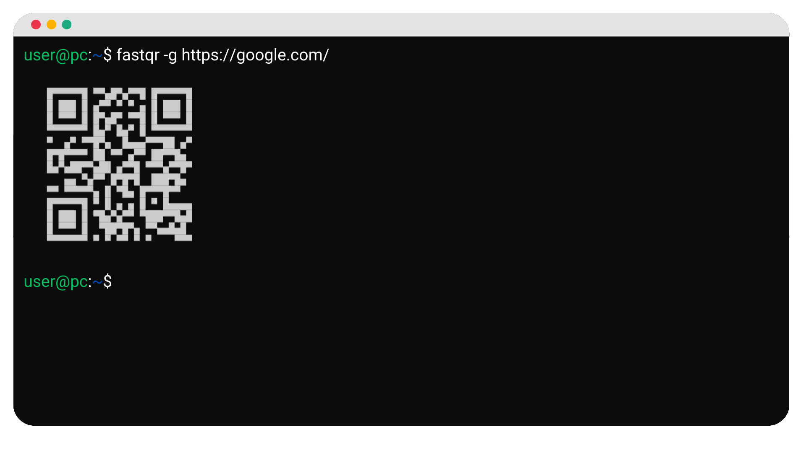

<div align="center">



# FastQR



</div>

FastQR est un outil simple et efficace pour générer des QR codes rapidement et facilement. Que vous soyez un utilisateur occasionnel ou un développeur, il vous permet de créer des QR codes en toute simplicité, directement depuis votre terminal<!-- ou en utilisant l'interface intégrée à votre barre des tâches (uniquement pour les appareils sous Windows) -->.


## Fonctionnalités

- Génération rapide
- Interface intuitive
- Personnalisation des QR codes

## Installation

### Windows
Téléchargez la dernière version en [cliquant ici](https://github.com/Luckyluka17/FastQR/releases/latest/download/fastqr.exe). Vous pouvez également visiter la page [releases](https://github.com/Luckyluka17/FastQR/releases).

> [!TIP]
> Pour avoir accès à l'exécutable sans être forcèment ouvrir un terminal dans le dossier où il est actuellement, vous pouvez ajouter **fastqr** au variables d'environnement. [Cliquez ici pour ouvrir la page associée sur la documentation](https://github.com/Luckyluka17/FastQR/wiki/Ajouter-FastQR-aux-variables-d'environnement).

### Linux
Paquets requis :
- git
- python3
- python3-pip

```bash
sudo su
git clone https://github.com/Luckyluka17/FastQR.git && pip install -r FastQR/requirements.txt
cp FastQR/fastqr.py /usr/bin/fastqr
chmod +x /usr/bin/fastqr
```

## Utilisation
Une fois installé, lancez **FastQR** depuis votre terminal en exécutant la commande suivante :

```bash
fastqr -g https://votrelien.com
```

Consultez la [documentation](https://github.com/Luckyluka17/FastQR/wiki) pour en savoir plus sur comment utiliser toutes ses fonctionnalitées.


## Compiler le code

> [!NOTE]  
> Veuillez remplacer le `python3` par `python` si vous êtes sur Windows.

> [!IMPORTANT]  
> Paquets requis pour compiler : python3, python3-pip

```bash
pip install pyinstaller
python3 -u build/build.py
```
Votre exécutable pour Windows sera par la suite disponible dans le dossier `dist`.

## Donation

<a href="https://www.buymeacoffee.com/luckyluka17" target="_blank"></a>